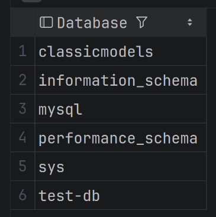

# 02 - Creating and managing databases

## Show database

```sql
SHOW DATABASES;
```



## Create a database

```sql
-- Syntax
CREATE DATABASE <db_name>;

-- Example
CREATE DATABASE finance_tracker_db;
```

- If you are not sure whether the database already exists, you can use the below query:

```sql
CREATE DATABASE IF NOT EXISTS <db_name>;
```

- It will create the database only if a database with that name does not already exist.

## Use a database

- Before starting work on a database, we need to select the database that we want to work with using the query as follows:

```sql
-- Syntax
USE <db_name>;

-- Example
USE classicmodels;
```

## Drop a database

- Dropping a database deletes the database and all the associated objects of the database.

```sql
-- Syntax
DROP DATABASE <db_name>;

-- Example
DROP DATABASE finance_tracker_db;
```

- You can also use the below query:

```sql
DROP DATABASE IF EXISTS <db_name>;
```

- Be very careful with `DROP DATABASE` because it permanently removes the database and all its tables/data.
- In production, this command should only be run after backups and approval.

## Naming conventions for database

- Use lowercase letters.
- Use snake_case for multi-word names.
- I personally add a `db` at the end.
- For eg: `fintrack_db`, `bug_tracker_db`, `student_master_db`.

## When to create a separate database

- I personally create one database per project.
- A database is meant to be specifically focusing on one business.
- That means if we have a database for students, we shouldn't be using the same database for a e-commerce application where the business case is completely different from the student.
