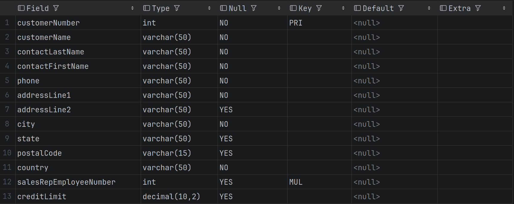
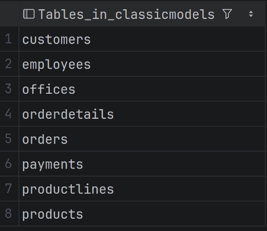

# 03 - Creating tables

## What is a table?

- A table is a database object used to store data in rows and columns.
- In a relational database, each table usually represents one entity or business concept.
- Examples:
  - customers
  - orders
  - products
  - employees
  - payments

- Each row represents one record.
- Each column represents one attribute/property of that record.

- Example: In a `customers` table:
  - one row represents one customer
  - columns represent customer details such as name, phone, city, and country

## Create a table

```sql
-- Syntax
CREATE TABLE <table_name> (
    column_1 data_type,
    column_2 data_type,
    column_n data_type,
);

-- Example
CREATE TABLE students (
    student_id INT,
    student_name VARCHAR(100),
    email VARCHAR(150),
    city VARCHAR(100)
);
```

- Before creating a table, select the database you want to work with.

```sql
CREATE TABLE IF NOT EXISTS test_students (
    student_id INT,
    student_name VARCHAR(100),
    email VARCHAR(150),
    city VARCHAR(100)
);
```

- This avoids an error if the table already exists.
- This does not update or modify an existing table.
- It only skips table creation if the table already exists.

## View table structure

```sql
-- Syntax
DESCRIBE <table_name>;

-- OR

DESC <table_name>;

-- Example
DESC customers;
```



- This shows information such as:
  - column names
  - data types
  - whether null values are allowed
  - keys
  - default values
  - extra details

## Show all tables in the selected database

```sql
SHOW TABLES;
```



- This lists all tables in the currently selected database.

## Show columns from a table

- Another way to view the columns of a table is:

```sql
-- Syntax
SHOW COLUMNS FROM <table_name>;

-- OR

SHOW COLUMNS FROM <db_name>.<table_name>;

-- Example
SHOW COLUMNS FROM products;
SHOW COLUMNS FROM classicmodels.customers;
```

## Drop a table

```sql
-- Syntax
DROP TABLE <table_name>;
```

- This deletes the table and its data.
- Safer version:

```sql
DROP TABLE IF EXISTS <table_name>;
```

- Be careful with DROP TABLE because it permanently removes the table and the data stored inside it.

## Table naming conventions

- Recommended:
  - use lowercase letters
  - use snake_case
  - use meaningful names
  - avoid spaces
  - avoid hyphens
  - stay consistent

```sql
students
test_students
customer_orders
product_lines
```

## Singular vs plural table names

### Plural table names

```
customers
orders
products
employees
```

- This style treats a table as a collection of records.
- Example, the `customers` table contains many customer rows.

### Singular table names

```
customer
order
product
employee
```

- This style treats a table as one entity type.
- Example: The `customer` table stores records of the Customer entity.

### Which one should I use?

- Both styles are used in real projects.
- For learning and for the classicmodels database, we will follow the plural style:

```
customers
orders
products
employees
```

- The most important thing is consistency.
- Do not mix singular and plural names randomly in the same project.

## Column naming conventions

- Recommended:
  - use lowercase letters
  - use snake_case
  - use meaningful names
  - avoid spaces
  - avoid hyphens
  - avoid unclear abbreviations

```
student_id
student_name
email
city
created_at
updated_at
order_date
credit_limit
```

- Column names should clearly describe the data stored in that column.

## Choosing appropriate data types

- When creating a table, each column must have a data type.
- A data type tells MySQL what kind of value the column will store.

```
INT
VARCHAR(100)
DECIMAL(10,2)
DATE
DATETIME
TIMESTAMP
TEXT
```

- Choose the data type based on the kind of data.

```
student_id INT
student_name VARCHAR(100)
email VARCHAR(150)
price DECIMAL(10,2)
order_date DATE
created_at TIMESTAMP
description TEXT
```

- Basic rules:
  - Use INT for whole numbers.
  - Use VARCHAR for short text values.
  - Use TEXT for longer text.
  - Use DECIMAL for money values.
  - Use DATE when only the date is needed.
  - Use DATETIME or TIMESTAMP when date and time are needed.
